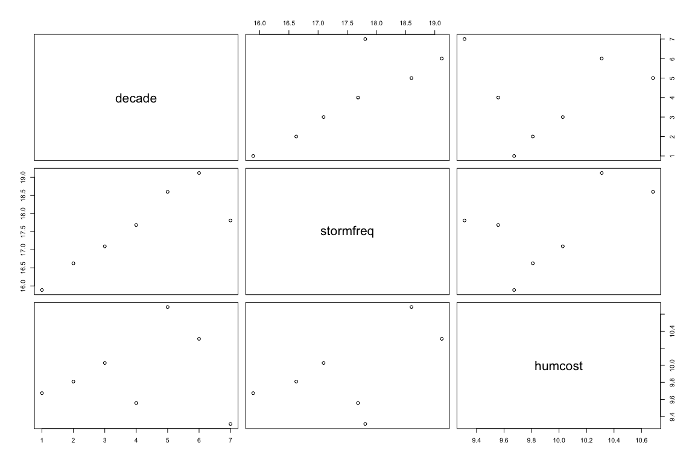
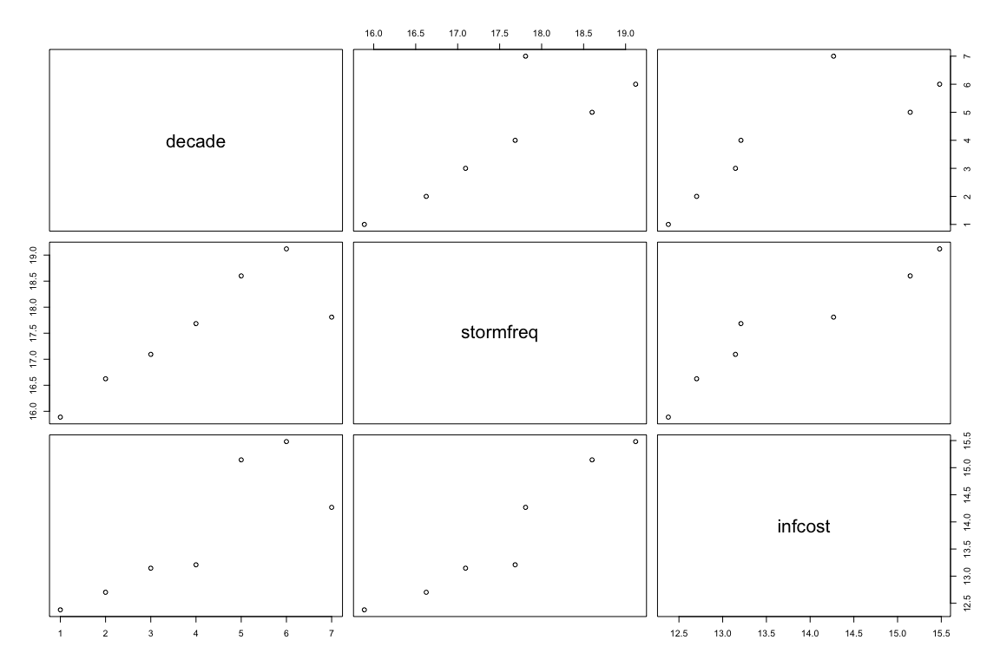
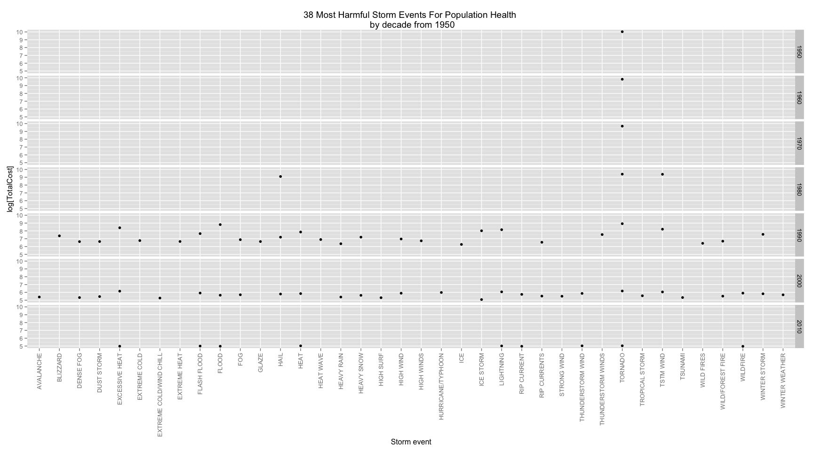
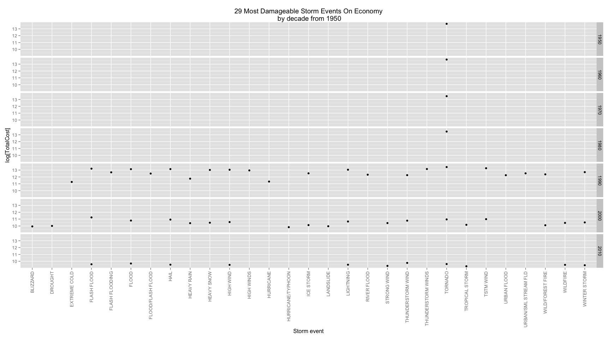

STORM EVENTS ANALYSIS IN THE U.S. BETWEEN 1950 AND 2011
===============================================================================
author: "Sabank"
date: "April 23, 2015"

Synopsis:
The basic goal of this assignment is to explore the National Oceanic and
Atmospheric Administration's (NOAA)Storm Database and answer some basic
questions about severe weather events in the United States between the years
1950 and 2011. From the data, findings show that, across the U.S., the number
of storm events has increased between 1950 and 2011, a strong correlation
exists with proprety damages, and a weaker one exists with population health.
It is censed 29 storm events that have the greatest economic consequences and
38 that are the most harmful for population health, TORNADO being the top of the
list.

## 1. DATA LOADING
From the "Storm Data" link, data is available in the form of a comma-separated-
value (.csv) file compressed via the bzip2 algorithm to reduce its size. Data
range from 1950 to 2011.

```r
## download url zip file
fileUrl <- "https://d396qusza40orc.cloudfront.net/repdata%2Fdata%2FStormData.csv.bz2"
bz2fileName <- "./StormData.csv.bz2"
download.file (fileUrl, bz2fileName, "curl")
## keep track of date of the download
dateDownloaded <- Sys.Date()
```
This file was last downloaded 2015-04-25

## 2. DATA PROCESSING
### 2.1 Load R libraries
Some of libraries used and required for this exploratory analysis.

```r
library(plyr); library(dplyr)
```

```
## 
## Attaching package: 'dplyr'
## 
## The following objects are masked from 'package:plyr':
## 
##     arrange, count, desc, failwith, id, mutate, rename, summarise,
##     summarize
## 
## The following object is masked from 'package:stats':
## 
##     filter
## 
## The following objects are masked from 'package:base':
## 
##     intersect, setdiff, setequal, union
```

```r
library(reshape2); library(Hmisc); library(stringr)
```

```
## Loading required package: grid
## Loading required package: lattice
```

```
## Warning: package 'lattice' was built under R version 3.1.3
```

```
## Loading required package: survival
## Loading required package: splines
## Loading required package: Formula
```

```
## Warning: package 'Formula' was built under R version 3.1.3
```

```
## Loading required package: ggplot2
```

```
## Warning: package 'ggplot2' was built under R version 3.1.3
```

```
## 
## Attaching package: 'Hmisc'
## 
## The following objects are masked from 'package:dplyr':
## 
##     combine, src, summarize
## 
## The following objects are masked from 'package:plyr':
## 
##     is.discrete, summarize
## 
## The following objects are masked from 'package:base':
## 
##     format.pval, round.POSIXt, trunc.POSIXt, units
```

```r
library(ggplot2)
```

### 2.2 Read file
As a csv file but bz2-compressed, bzfile is required to access the file along
with the call for read.csv.

```r
file <- read.csv(bzfile(bz2fileName, "r"), header = TRUE, sep = ",",
                 na.string = "", strip.white = TRUE,
                 blank.lines.skip = TRUE)
```

### 2.3 Data analysis
After reading the file, we extract the columns of interest and proceed to an
analysis of the dataset to get a sens of what it is going on.

```r
# columns of interest
dataset <- file[,c(2,8,21,23:28)]; dim(dataset)
```

```
## [1] 902297      9
```

```r
# considering the dimension of the dataset,
# let's transform BGN_DATE in a new variable 'decade' that groups date by decade
dataset <- dataset %>%
    mutate(date = as.POSIXct(BGN_DATE, format = "%m/%e/%Y %k:%M:%S"),
           decade = cut(as.POSIXlt(date)$year,
                        breaks = c(49,59,69,79,89,99,109,119),
                        labels = c("1950","1960","1970","1980","1990",
                                   "2000","2010")))
```
Statistics show that variables of interest have no NA values

```r
# FATALITIES, INJURIES, PROPDMG and CROPDMG
summary(dataset)
```

```
## Warning: closing unused connection 5 (./StormData.csv.bz2)
```

```
##               BGN_DATE                    EVTYPE             F         
##  5/25/2011 0:00:00:  1202   HAIL             :288661   Min.   :0.0     
##  4/27/2011 0:00:00:  1193   TSTM WIND        :219940   1st Qu.:0.0     
##  6/9/2011 0:00:00 :  1030   THUNDERSTORM WIND: 82563   Median :1.0     
##  5/30/2004 0:00:00:  1016   TORNADO          : 60652   Mean   :0.9     
##  4/4/2011 0:00:00 :  1009   FLASH FLOOD      : 54277   3rd Qu.:1.0     
##  4/2/2006 0:00:00 :   981   FLOOD            : 25326   Max.   :5.0     
##  (Other)          :895866   (Other)          :170878   NA's   :843563  
##    FATALITIES          INJURIES            PROPDMG          PROPDMGEXP    
##  Min.   :  0.0000   Min.   :   0.0000   Min.   :   0.00   K      :424665  
##  1st Qu.:  0.0000   1st Qu.:   0.0000   1st Qu.:   0.00   M      : 11330  
##  Median :  0.0000   Median :   0.0000   Median :   0.00   0      :   216  
##  Mean   :  0.0168   Mean   :   0.1557   Mean   :  12.06   B      :    40  
##  3rd Qu.:  0.0000   3rd Qu.:   0.0000   3rd Qu.:   0.50   5      :    28  
##  Max.   :583.0000   Max.   :1700.0000   Max.   :5000.00   (Other):    84  
##                                                           NA's   :465934  
##     CROPDMG          CROPDMGEXP          date                    
##  Min.   :  0.000   K      :281832   Min.   :1950-01-03 00:00:00  
##  1st Qu.:  0.000   M      :  1994   1st Qu.:1995-04-20 00:00:00  
##  Median :  0.000   k      :    21   Median :2002-03-18 00:00:00  
##  Mean   :  1.527   0      :    19   Mean   :1998-12-27 22:50:00  
##  3rd Qu.:  0.000   B      :     9   3rd Qu.:2007-07-28 00:00:00  
##  Max.   :990.000   (Other):     9   Max.   :2011-11-30 00:00:00  
##                    NA's   :618413                                
##   decade      
##  1950: 11191  
##  1960: 25065  
##  1970: 39110  
##  1980: 75191  
##  1990:228577  
##  2000:412828  
##  2010:110335
```

```r
# this confirms there is no NA values for variable regarding population
sum(is.na(dataset$FATALITIES)); sum(is.na(dataset$INJURIES))
```

```
## [1] 0
```

```
## [1] 0
```

```r
# this confirms there is no NA values for variable regarding infrastucture
sum(is.na(dataset$PROPDMG)); sum(is.na(dataset$CROPDMG))
```

```
## [1] 0
```

```
## [1] 0
```
However, data show redundancy and inadequate classification in variables EVTYPE,
PROPDMGEXP and CROPDMGEXP.

```r
# reshape data for analysis
newdataset <- dataset
newdataset$PROPDMGEXP <- toupper(newdataset$PROPDMGEXP)
newdataset$CROPDMGEXP <- toupper(newdataset$CROPDMGEXP)
nd_m <- melt(newdataset, id = c("decade", "EVTYPE", "PROPDMGEXP", "CROPDMGEXP"),
             measure.vars = c("PROPDMG", "CROPDMG"))
```
Statistics on variable PROPDMGEXP show unconventional classification that we can
disregard (their mean is low) and a non neglectible amount of NA values. As
these NA values don't define a quantity as per Million, Billion, etc., the
overall analysis is based on the relative ("as is") value of the cost.

```r
prop <- dcast(nd_m, EVTYPE ~ PROPDMGEXP, sum); summary(prop)
```

```
##                    EVTYPE          -                  ?    
##     HIGH SURF ADVISORY:  1   Min.   : 0.00000   Min.   :0  
##   COASTAL FLOOD       :  1   1st Qu.: 0.00000   1st Qu.:0  
##   FLASH FLOOD         :  1   Median : 0.00000   Median :0  
##   LIGHTNING           :  1   Mean   : 0.01523   Mean   :0  
##   TSTM WIND           :  1   3rd Qu.: 0.00000   3rd Qu.:0  
##   TSTM WIND (G45)     :  1   Max.   :15.00000   Max.   :0  
##  (Other)              :979                                 
##        +                 0                  1           2           
##  Min.   : 0.0000   Min.   :   0.000   Min.   :0   Min.   : 0.00000  
##  1st Qu.: 0.0000   1st Qu.:   0.000   1st Qu.:0   1st Qu.: 0.00000  
##  Median : 0.0000   Median :   0.000   Median :0   Median : 0.00000  
##  Mean   : 0.1188   Mean   :   7.436   Mean   :0   Mean   : 0.01218  
##  3rd Qu.: 0.0000   3rd Qu.:   0.000   3rd Qu.:0   3rd Qu.: 0.00000  
##  Max.   :60.0000   Max.   :5808.100   Max.   :0   Max.   :12.00000  
##                                                                     
##        3                  4                  5           
##  Min.   : 0.00000   Min.   : 0.00000   Min.   :  0.0000  
##  1st Qu.: 0.00000   1st Qu.: 0.00000   1st Qu.:  0.0000  
##  Median : 0.00000   Median : 0.00000   Median :  0.0000  
##  Mean   : 0.02284   Mean   : 0.01472   Mean   :  0.6756  
##  3rd Qu.: 0.00000   3rd Qu.: 0.00000   3rd Qu.:  0.0000  
##  Max.   :22.50000   Max.   :10.00000   Max.   :448.4000  
##                                                          
##        6                  7                  8           B          
##  Min.   : 0.00000   Min.   : 0.00000   Min.   :0   Min.   :  0.000  
##  1st Qu.: 0.00000   1st Qu.: 0.00000   1st Qu.:0   1st Qu.:  0.000  
##  Median : 0.00000   Median : 0.00000   Median :0   Median :  0.000  
##  Mean   : 0.06599   Mean   : 0.08325   Mean   :0   Mean   :  1.897  
##  3rd Qu.: 0.00000   3rd Qu.: 0.00000   3rd Qu.:0   3rd Qu.:  0.000  
##  Max.   :65.00000   Max.   :68.00000   Max.   :0   Max.   :806.700  
##                                                                     
##        H                  K                 M                 NA          
##  Min.   : 0.00000   Min.   :      0   Min.   :    0.0   Min.   :     0.0  
##  1st Qu.: 0.00000   1st Qu.:      0   1st Qu.:    0.0   1st Qu.:     0.0  
##  Median : 0.00000   Median :      0   Median :    0.0   Median :     0.0  
##  Mean   : 0.02741   Mean   :  11869   Mean   :  326.6   Mean   :   242.8  
##  3rd Qu.: 0.00000   3rd Qu.:     30   3rd Qu.:    0.0   3rd Qu.:     0.0  
##  Max.   :20.00000   Max.   :3228963   Max.   :76678.1   Max.   :161704.9  
## 
```
Same apply to the variable CROPDMGEXP

```r
crop <- dcast(nd_m, EVTYPE ~ CROPDMGEXP, sum); summary(crop)
```

```
##                    EVTYPE          ?                  0           
##     HIGH SURF ADVISORY:  1   Min.   :  0.0000   Min.   :  0.0000  
##   COASTAL FLOOD       :  1   1st Qu.:  0.0000   1st Qu.:  0.0000  
##   FLASH FLOOD         :  1   Median :  0.0000   Median :  0.0000  
##   LIGHTNING           :  1   Mean   :  0.4892   Mean   :  0.5508  
##   TSTM WIND           :  1   3rd Qu.:  0.0000   3rd Qu.:  0.0000  
##   TSTM WIND (G45)     :  1   Max.   :400.5000   Max.   :335.0000  
##  (Other)              :979                                        
##        2           B                  K                M          
##  Min.   :0   Min.   :  0.0000   Min.   :     0   Min.   :    0.0  
##  1st Qu.:0   1st Qu.:  0.0000   1st Qu.:     0   1st Qu.:    0.0  
##  Median :0   Median :  0.0000   Median :     0   Median :    0.0  
##  Mean   :0   Mean   :  0.5325   Mean   :  5311   Mean   :  183.8  
##  3rd Qu.:0   3rd Qu.:  0.0000   3rd Qu.:     0   3rd Qu.:    0.0  
##  Max.   :0   Max.   :505.0000   Max.   :923473   Max.   :45526.9  
##                                                                   
##        NA         
##  Min.   :      0  
##  1st Qu.:      0  
##  Median :      0  
##  Mean   :   6952  
##  3rd Qu.:     17  
##  Max.   :2583135  
## 
```

## 3. RESULTS
In this panel plot, we see in the 3 bottom-left-corner graphs the increase in
the number of event through the period of reference, the existing relationship
between "stromfreq" (frequence of event) and "infcost" (economic cost), the
relationship between stormfreq and "humcost" (popultion health cost) as well.

```r
allhum <- summarise(group_by(dataset, decade), stormfreq = log(sum(EVTYPE)),
                   humcost = log(sum(FATALITIES) + sum(INJURIES)))
allinf <- summarise(group_by(dataset, decade), stormfreq = log(sum(EVTYPE)),
                   infcost = log(sum(PROPDMG) + sum(CROPDMG)))
par(mfcol=c(2,1))
plot(allhum); plot(allinf)
```

  

### 3.1 Which types of events are most harmful with respect to population health?
The following plot shows the 38 most harmful events for population health. The
selection represents the values above the average cost of combined fatalities
and injuries. Complementary code is also available for discretisation by category.

```r
## pop health status
nd_hum_m <- melt(newdataset, id = c("decade", "EVTYPE"),
             measure.vars = c("FATALITIES", "INJURIES"))
humcost <- dcast(nd_hum_m, decade + EVTYPE ~ variable, sum, margins = "variable")
summary(humcost)
```

```
##   decade              EVTYPE       FATALITIES         INJURIES      
##  1950:  3   HAIL         :   7   Min.   :   0.00   Min.   :    0.0  
##  1960:  3   TORNADO      :   7   1st Qu.:   0.00   1st Qu.:    0.0  
##  1970:  3   TSTM WIND    :   6   Median :   0.00   Median :    0.0  
##  1980:  3   AVALANCHE    :   3   Mean   :  12.98   Mean   :  120.4  
##  1990:913   BLIZZARD     :   3   3rd Qu.:   0.00   3rd Qu.:    0.0  
##  2000:196   COASTAL FLOOD:   3   Max.   :1419.00   Max.   :21640.0  
##  2010: 46   (Other)      :1138                                      
##      (all)        
##  Min.   :    0.0  
##  1st Qu.:    0.0  
##  Median :    0.0  
##  Mean   :  133.4  
##  3rd Qu.:    1.0  
##  Max.   :22638.0  
## 
```

```r
# ordering descending
humcost_ord <- arrange(humcost, desc(humcost[,5]))
# filtering values above mean
humcost_most <- filter(humcost_ord, humcost_ord[,5] > mean(humcost_ord[,5]))
g1 <- ggplot(humcost_most)
g1 + geom_point(aes(x=EVTYPE, y=log(humcost_most[,5]))) +
    facet_grid(decade ~.) +
    theme(axis.text.x=element_text(angle=90,hjust=1,vjust=0.5)) +
    labs(title = "38 Most Harmful Storm Events For Population Health \n by decade from 1950") +
    labs(x = "Storm event", y = expression("log[TotalCost]"))
```

 

```r
## fatalities
# ordering descending
#fata_ord <- arrange(humcost, desc(humcost[,3]))
# filtering values above the mean
#fata_most <- filter(fata_ord, fata_ord[,3] > mean(fata_ord[,3]))
#g2 <- ggplot(fata_most)
#g2 + geom_point(aes(x=EVTYPE, y=log(fata_most[,3]))) +
#    facet_grid(decade ~.) +
#    theme(axis.text.x=element_text(angle=90,hjust=1,vjust=0.5)) +
#    labs(title = "Storm Events Causing The Most Of Fatalities \n by decade from 1950") +
#    labs(x = "Storm event", y = expression("log[TotalCost]"))

## injuries
# ordering descending
#inju_ord <- arrange(humcost, desc(humcost[,4]))
# filtering values above mean
#inju_most <- filter(inju_ord, inju_ord[,4] > mean(inju_ord[,4]))
#g3 <- ggplot(inju_most)
#g3 + geom_point(aes(x=EVTYPE, y=log(inju_most[,4]))) +
#    facet_grid(decade ~.) +
#    theme(axis.text.x=element_text(angle=90,hjust=1,vjust=0.5)) +
#    labs(title = "Storm Events Causing The Most Of Injuries \n by decade from 1950") +
#    labs(x = "Storm event", y = expression("log[TotalCost]"))
```

### 3.2 Which types of events have the greatest economic consequences?
The following plot shows the 29 most damageable events for economy. The
selection represents the values above the average cost of combined properties
and crops. Complementary code is also available for discretisation by category.

```r
## infra status
nd_inf_m <- melt(newdataset, id = c("decade", "EVTYPE", "PROPDMGEXP", "CROPDMGEXP"),
             measure.vars = c("PROPDMG", "CROPDMG"))
infcost <- dcast(nd_inf_m, decade + EVTYPE ~ variable, sum, margins = "variable")
summary(infcost)
```

```
##   decade              EVTYPE        PROPDMG            CROPDMG      
##  1950:  3   HAIL         :   7   Min.   :     0.0   Min.   :     0  
##  1960:  3   TORNADO      :   7   1st Qu.:     0.0   1st Qu.:     0  
##  1970:  3   TSTM WIND    :   6   Median :     0.0   Median :     0  
##  1980:  3   AVALANCHE    :   3   Mean   :  9326.9   Mean   :  1181  
##  1990:913   BLIZZARD     :   3   3rd Qu.:    51.6   3rd Qu.:     0  
##  2000:196   COASTAL FLOOD:   3   Max.   :811528.2   Max.   :321822  
##  2010: 46   (Other)      :1138                                      
##      (all)         
##  Min.   :     0.0  
##  1st Qu.:     0.0  
##  Median :     0.0  
##  Mean   : 10507.6  
##  3rd Qu.:    66.8  
##  Max.   :920587.1  
## 
```

```r
# ordering descending
infcost_ord <- arrange(infcost, desc(infcost[,5]))
# filtering values above mean
infcost_most <- filter(infcost_ord, infcost_ord[,5] > mean(infcost_ord[,5]))
g4 <- ggplot(infcost_most)
g4 + geom_point(aes(x=EVTYPE, y=log(infcost_most[,5]))) +
    facet_grid(decade ~.) +
    theme(axis.text.x=element_text(angle=90,hjust=1,vjust=0.5)) +
    labs(title = " 29 Most Damageable Storm Events On Economy \n by decade from 1950") +
    labs(x = "Storm event", y = expression("log[TotalCost]"))
```

 

```r
## prop
#prop <- dcast(nd_m, decade + EVTYPE ~ PROPDMGEXP, sum, margins = "PROPDMGEXP")
#summary(prop)
# ordering descending
#prop_ord <- arrange(prop, desc(prop[,20]))
# filtering values above mean
#prop_most <- filter(prop_ord, prop_ord[,20] > mean(prop_ord[,20]))
#g5 <- ggplot(prop_most)
#g5 + geom_point(aes(x=EVTYPE, y=log(prop_most[,20]))) +
#    facet_grid(decade ~.) +
#    theme(axis.text.x=element_text(angle=90,hjust=1,vjust=0.5)) +
#    labs(title = "Storm Events Causing The Most Damage On Properties \n by decade from 1950") +
#    labs(x = "Storm event", y = expression("log[TotalCost]"))

## crop
#crop <- dcast(nd_m, decade + EVTYPE ~ CROPDMGEXP, sum, margins = "CROPDMGEXP")
#summary(crop)
# ordering descending
#crop_ord <- arrange(crop, desc(crop[,10]))
# filtering values above mean
#crop_most <- filter(crop_ord, crop_ord[,10] > mean(crop_ord[,10]))
#g6 <- ggplot(crop_most)
#g6 + geom_point(aes(x=EVTYPE, y=log(crop_most[,10]))) +
#    facet_grid(decade ~.) +
#    theme(axis.text.x=element_text(angle=90,hjust=1,vjust=0.5)) + 
#    labs(title = "Storm Events Causing The Most Damage On Crops \n by decade from 1950") +
#    labs(x = "Storm event", y = expression("log[TotalCost]"))
```
